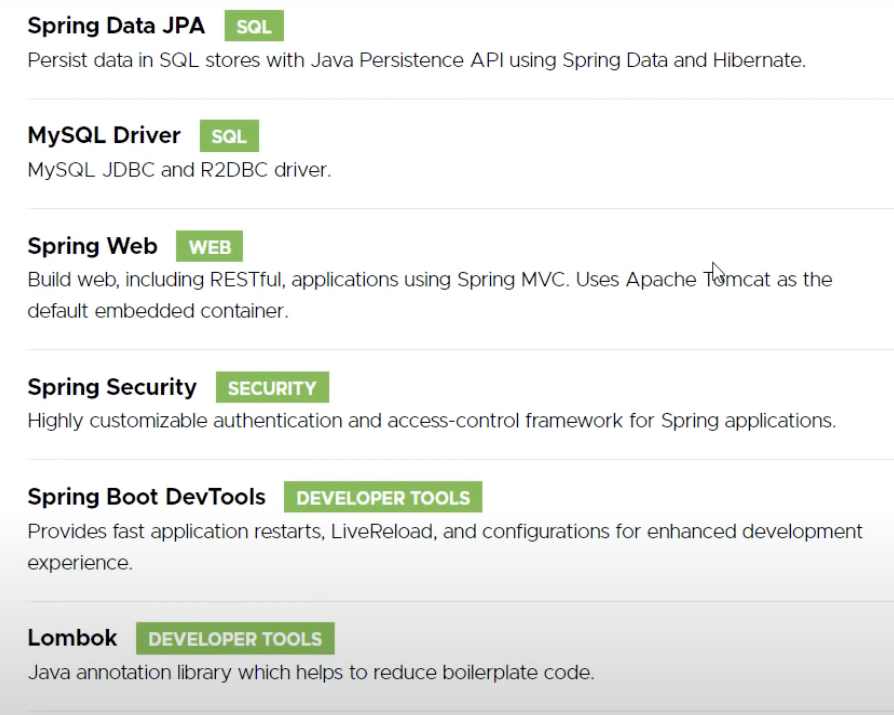
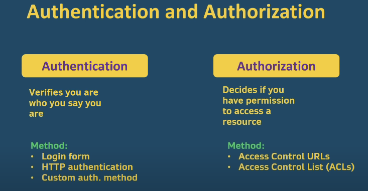

># Spring Boot and Spring Security with JWT including Access and Refresh Tokens 


## Spring Boot Backend

### dependencies



### Database

#### domain

- User
  ```java
  @Entity @Data @NoArgsConstructor @AllArgsConstructor
  public class User {
      @Id @GeneratedValue(strategy = GenerationType.AUTO)
      private long id;
      private String name;
      private String username;
      private String password;
      @ManyToMany(fetch = FetchType.EAGER)
      private Collection<Role> roles = new ArrayList<>();
  }
  ```

- Role
  ```java
  @Entity
  @Data
  @NoArgsConstructor
  @AllArgsConstructor
  public class Role {
      @Id
      @GeneratedValue(strategy = GenerationType.AUTO)
      private long id;
      private String name;
  }
  ```

#### repo

- RoleRepo
  ```java
  public interface RoleRepo extends JpaRepository<Role, Long> {
      Role findByName(String name);
  }
  ```

- UserRepo
  ```java
  public interface UserRepo extends JpaRepository<User, Long> {
      User findByUsername(String username);
  }
  ```

#### service and `Impl`

- `UserService`

  ```java
  public interface UserService {
      User saveUser(User user);
      Role saveRole(Role role);
      void addRoleToUser(String username, String roleName);
      User getUser(String username);
      List<User> getUsers();
  }
  ```

- `UserServiceImpl`

  ```java
  @Service 
  @RequiredArgsConstructor 
  @Transactional 
  @Slf4j
  public class UserServiceImpl implements UserService{
      private final UserRepo userRepo;
      private final RoleRepo roleRepo;
  
      @Override
      public User saveUser(User user) {
          return userRepo.save(user);
      }
  
      @Override
      public Role saveRole(Role role) {
          return roleRepo.save(role);
      }
  
      @Override
      public void addRoleToUser(String username, String roleName) {
          User user = userRepo.findByUsername(username);
          Role role = roleRepo.findByName(roleName);
          user.getRoles().add(role);
      }
  
      @Override
      public User getUser(String username) {
          return userRepo.findByUsername(username);
      }
  
      @Override
      public List<User> getUsers() {
          return userRepo.findAll();
      }
  }
  ```


#### `log4j`

```java
public class UserServiceImpl implements UserService{
    private final UserRepo userRepo;
    private final RoleRepo roleRepo;

    @Override
    public User saveUser(User user) {
        log.info("Saving new user {} to the database", user.getName());
        return userRepo.save(user);
    }

    @Override
    public Role saveRole(Role role) {
        log.info("Saving new role {} to the database", role.getName());
        return roleRepo.save(role);
    }

    @Override
    public void addRoleToUser(String username, String roleName) {
        log.info("Adding tole {} to user {}", roleName, username);
        User user = userRepo.findByUsername(username);
        Role role = roleRepo.findByName(roleName);
        user.getRoles().add(role);
    }

    @Override
    public User getUser(String username) {
        log.info("Fetching user {}", username);
        return userRepo.findByUsername(username);
    }

    @Override
    public List<User> getUsers() {
        log.info("Fetching users");
        return userRepo.findAll();
    }
}
```

#### create `api`

```java
@RestController
@RequestMapping("/api")
@RequiredArgsConstructor
public class UserResource {
    private final UserService userService;

    @GetMapping("/users")
    public ResponseEntity<List<User>> getUsers() {
        return ResponseEntity.ok().body(userService.getUsers());
    }

   @PostMapping("/user/save")
   public ResponseEntity<User> saveUser(@RequestBody User user) {
       URI uri = URI.create(ServletUriComponentsBuilder.fromCurrentContextPath().path("/api/user/save").toUriString());
       return ResponseEntity.created(uri).body(userService.saveUser(user));
   }

    @PostMapping("/role/save")
    public ResponseEntity<Role> saveRole(@RequestBody Role role) {
        URI uri = URI.create(ServletUriComponentsBuilder.fromCurrentContextPath().path("/api/role/save").toUriString());
        // in these, 201 is better than 200, so we need create a url which from java.net
        return ResponseEntity.created(uri).body(userService.saveRole(role));
    }

    @PostMapping("/role/addtouser")
    public ResponseEntity<?> saveRoleToUser(@RequestBody RoleToUserForm form) {
        userService.addRoleToUser(form.getUsername(), form.getRoleName());
        return ResponseEntity.ok().build();
    }
}
@Data
class RoleToUserForm {
    private String username;
    private String roleName;
}
```

#### properties

```properties
server.port=3000
spring.datasource.url=jdbc:mysql://localhost:3306/userservice?serverTimezone=Asia/Shanghai&useUnicode=true&characterEncoding=utf-8
spring.datasource.username=root
spring.datasource.password=Rml901217
spring.datasource.driver-class-name=com.mysql.cj.jdbc.Driver
spring.jpa.hibernate.ddl-auto=create
spring.jpa.show-sql=true
spring.jpa.properties.hibernate.dialect=org.hibernate.dialect.MySQL8Dialect
spring.jpa.properties.hibernate.format_sql=true
```

#### Test

```java
@SpringBootApplication
public class UserserviceApplication {

    public static void main(String[] args) {
        SpringApplication.run(UserserviceApplication.class, args);
    }

    @Bean
    CommandLineRunner run (UserService userService) {
        return args -> {
            userService.saveRole(new Role(null, "ROLE_USER"));
            userService.saveRole(new Role(null, "ROLE_MANAGER"));
            userService.saveRole(new Role(null, "ROLE_ADMIN"));
            userService.saveRole(new Role(null, "ROLE_SUPER_ADMIN"));


            userService.saveUser(new User(null, "John Travolta", "john", "1234", new ArrayList<>()));
            userService.saveUser(new User(null, "Will Smith", "will", "1234", new ArrayList<>()));
            userService.saveUser(new User(null, "Jim Carry", "jim", "1234", new ArrayList<>()));
            userService.saveUser(new User(null, "Arnold Schwarzenegger", "arnold", "1234", new ArrayList<>()));

            userService.addRoleToUser("john", "ROLE_USER");
            userService.addRoleToUser("john", "ROLE_MANAGER");
            userService.addRoleToUser("will", "ROLE_MANAGER");
            userService.addRoleToUser("jim", "ROLE_ADMIN");
            userService.addRoleToUser("arnold", "ROLE_SUPER_ADMIN");
            userService.addRoleToUser("arnold", "ROLE_ADMIN");
            userService.addRoleToUser("arnold", "ROLE_USER");
        };
    }
}
```

```java
[
    {"id":5,"name":"John Travolta","username":"john","password":"1234","roles":[
        {"id":1,"name":"ROLE_USER"},
        {"id":2,"name":"ROLE_MANAGER"}
    ]},
    {"id":6,"name":"Will Smith","username":"will","password":"1234","roles":[
        {"id":2,"name":"ROLE_MANAGER"}
    ]},
    {"id":7,"name":"Jim Carry","username":"jim","password":"1234","roles":[
        {"id":3,"name":"ROLE_ADMIN"}
    ]},
    {"id":8,"name":"Arnold Schwarzenegger","username":"arnold","password":"1234","roles":[
        {"id":4,"name":"ROLE_SUPER_ADMIN"},
        {"id":3,"name":"ROLE_ADMIN"},
        {"id":1,"name":"ROLE_USER"}]}
]
```

## Spring Security

### frame in `SecurityConfig`

```java
@Configuration 
@EnableWebSecurity 
@RequiredArgsConstructor
public class SecurityConfig extends WebSecurityConfigurerAdapter {
    private final UserDetailsService userDetailsService;
    private final BCryptPasswordEncoder bCryptPasswordEncoder;

    @Override
    protected void configure(AuthenticationManagerBuilder auth) throws Exception {
        auth.userDetailsService(userDetailsService).passwordEncoder(bCryptPasswordEncoder);
    }

    @Override
    protected void configure(HttpSecurity http) throws Exception {
        super.configure(http);
    }
}
```

### add `passwordEncoder` to Main

```java
@Bean
PasswordEncoder passwordEncoder () {
    return new BCryptPasswordEncoder();
}
```

### Add permission

```java
public class UserServiceImpl implements UserService, UserDetailsService {
    private final UserRepo userRepo;
    private final RoleRepo roleRepo;

    @Override
    public UserDetails loadUserByUsername(String username) throws UsernameNotFoundException {
        User user = userRepo.findByUsername(username);
        if (user == null) {
            log.error("User not found in the database");
            throw new UsernameNotFoundException("User not fount in the database");
        } else {
            log.info("User found in the database: {}", username);
        }
        Collection<SimpleGrantedAuthority> authorities = new ArrayList<>();
        user.getRoles().forEach(role -> {
            authorities.add(new SimpleGrantedAuthority(role.getName()));
        });
        return new org.springframework.security.core.userdetails.User(user.getUsername(), user.getPassword(), authorities);
    }
}
```

## Authentication and Authorization



### add filter in `SecurityConfig`

```java
@Configuration @EnableWebSecurity @RequiredArgsConstructor
public class SecurityConfig extends WebSecurityConfigurerAdapter {
    ...

    @Override
    protected void configure(HttpSecurity http) throws Exception {
        http.csrf().disable();
        http.sessionManagement().sessionCreationPolicy(STATELESS);
        http.authorizeRequests().anyRequest().permitAll();
        http.addFilter(new CustomerAuthenticationFilter(authenticationManagerBean()));
    }

    @Bean
    @Override
    public AuthenticationManager authenticationManagerBean() throws Exception {
        return super.authenticationManagerBean();
    }
}
```

### Configure filters

```java
@Slf4j
public class CustomerAuthenticationFilter extends UsernamePasswordAuthenticationFilter {
    private final AuthenticationManager authenticationManager;

    public CustomerAuthenticationFilter(AuthenticationManager authenticationManager) {
        this.authenticationManager = authenticationManager;
    }
    @Override
    public Authentication attemptAuthentication(HttpServletRequest request, HttpServletResponse response) throws AuthenticationException {
        String username = request.getParameter("username");
        String password = request.getParameter("password");
        log.info("Username is: {}", username);
        log.info("Password is: {}", password);
        UsernamePasswordAuthenticationToken authenticationToken = new UsernamePasswordAuthenticationToken(username, password);
        return authenticationManager.authenticate(authenticationToken);
    }

    @Override
    protected void successfulAuthentication(HttpServletRequest request, HttpServletResponse response, FilterChain chain, Authentication authResult) throws IOException, ServletException {
        super.successfulAuthentication(request, response, chain, authResult);
    }
}
```

## JWT

> security with JSON Web Token

### import jwt dependencies

```xml
<dependency>
    <groupId>com.auth0</groupId>
    <artifactId>java-jwt</artifactId>
    <version>4.0.0</version>
</dependency>
```

### Wrap in `CustomerAuthenticationFilter`

> wrap the successfully verified jwt and configuration information

```java
@Override
protected void successfulAuthentication(HttpServletRequest request, HttpServletResponse response, FilterChain chain, Authentication authentication) throws IOException, ServletException {
    User user = (User) authentication.getPrincipal();
    Algorithm algorithm = Algorithm.HMAC256("secret".getBytes());
    String access_token = JWT.create()
        .withSubject(user.getUsername())
        .withExpiresAt(new Date(System.currentTimeMillis() + 10 * 60 * 1000))
        .withIssuer(request.getRequestURI())
        .withClaim("roles", user.getAuthorities().stream().map(GrantedAuthority::getAuthority).collect(Collectors.toList()))
        .sign(algorithm);
    String refresh_token = JWT.create()
        .withSubject(user.getUsername())
        .withExpiresAt(new Date(System.currentTimeMillis() + 30 * 60 * 1000))
        .withIssuer(request.getRequestURI())
        .sign(algorithm);
    
    //response.setHeader("access_token", access_token);
    //response.setHeader("refresh_token", refresh_token);
    Map<String, String> tokens = new HashMap<>();
        tokens.put("access_token", access_token);
        tokens.put("refresh_token", refresh_token);
        response.setContentType(APPLICATION_JSON_VALUE);
        new ObjectMapper().writeValue(response.getOutputStream(), tokens);
}
```

### encode password before save user in `UserServiceImpl`

```java
private final PasswordEncoder passwordEncoder;

@Override
public User saveUser (User user) {
    log.info("Saving new user {} to the database", user.getName());
    user.setPassword(passwordEncoder.encode(user.getPassword()));
    return userRepo.save(user);
}
```

### add filter for user

```java
@Configuration @EnableWebSecurity @RequiredArgsConstructor
public class SecurityConfig extends WebSecurityConfigurerAdapter {
    private final UserDetailsService userDetailsService;
    private final BCryptPasswordEncoder bCryptPasswordEncoder;

    @Override
    protected void configure(AuthenticationManagerBuilder auth) throws Exception {
        auth.userDetailsService(userDetailsService).passwordEncoder(bCryptPasswordEncoder);
    }

    @Override
    protected void configure(HttpSecurity http) throws Exception {
        http.csrf().disable();
        http.sessionManagement().sessionCreationPolicy(STATELESS);
        http.authorizeRequests().antMatchers("/login").permitAll();
        http.authorizeRequests().antMatchers(GET, "/api/user/**").hasAnyAuthority("ROLE_USER");
        http.authorizeRequests().antMatchers(POST, "/api/user/save/**").hasAnyAuthority("ROLE_ADMIN");
        http.authorizeRequests().anyRequest().authenticated();
        http.addFilter(new CustomerAuthenticationFilter(authenticationManagerBean()));
    }

    @Bean
    @Override
    public AuthenticationManager authenticationManagerBean() throws Exception {
        return super.authenticationManagerBean();
    }
}
```

### Obtain permissions and filter through jwt

```java
package io.getarrays.userservice.security.filter;

import com.auth0.jwt.JWT;
import com.auth0.jwt.JWTVerifier;
import com.auth0.jwt.algorithms.Algorithm;
import com.auth0.jwt.interfaces.DecodedJWT;
import com.fasterxml.jackson.databind.ObjectMapper;
import lombok.extern.slf4j.Slf4j;
import org.springframework.security.authentication.UsernamePasswordAuthenticationToken;
import org.springframework.security.core.authority.SimpleGrantedAuthority;
import org.springframework.security.core.context.SecurityContextHolder;
import org.springframework.web.filter.OncePerRequestFilter;

import javax.servlet.FilterChain;
import javax.servlet.ServletException;
import javax.servlet.http.HttpServletRequest;
import javax.servlet.http.HttpServletResponse;
import java.io.IOException;
import java.util.ArrayList;
import java.util.Collection;
import java.util.HashMap;
import java.util.Map;

import static java.util.Arrays.stream;
import static org.springframework.http.HttpHeaders.AUTHORIZATION;
import static org.springframework.http.HttpStatus.FORBIDDEN;
import static org.springframework.util.MimeTypeUtils.APPLICATION_JSON_VALUE;

@Slf4j
public class CustomAuthorizationFilter extends OncePerRequestFilter {
    @Override
    protected void doFilterInternal(HttpServletRequest request, HttpServletResponse response, FilterChain filterChain) throws ServletException, IOException {
        if (request.getServletPath().equals("/api/login")) {
            filterChain.doFilter(request, response);
        } else {
            String authorizationHeader = request.getHeader(AUTHORIZATION);
            if (authorizationHeader != null && authorizationHeader.startsWith("Bearer ")) {
                try {
                    String token = authorizationHeader.substring("Bearer ".length());
                    Algorithm algorithm = Algorithm.HMAC256("secret".getBytes());
                    JWTVerifier verifier = JWT.require(algorithm).build();
                    DecodedJWT decodedJWT = verifier.verify(token);
                    String username = decodedJWT.getSubject();
                    String[] roles = decodedJWT.getClaim("roles").asArray(String.class);
                    Collection<SimpleGrantedAuthority> authorities = new ArrayList<>();
                    stream(roles).forEach(role -> {
                        authorities.add(new SimpleGrantedAuthority(role));
                    });
                    UsernamePasswordAuthenticationToken authenticationToken
                            = new UsernamePasswordAuthenticationToken(username, null, authorities);
                    SecurityContextHolder.getContext().setAuthentication(authenticationToken);
                    filterChain.doFilter(request, response);
                } catch (Exception exception) {
                    log.error("Error logging in: {}", exception.getMessage());
                    response.setHeader("error", exception.getMessage());
                    response.setStatus(FORBIDDEN.value());
                    //response.sendError(FORBIDDEN.value());
                    Map<String, String> error = new HashMap<>();
                    error.put("error_message", exception.getMessage());
                    response.setContentType(APPLICATION_JSON_VALUE);
                    new ObjectMapper().writeValue(response.getOutputStream(), error);
                }
            } else {
                filterChain.doFilter(request, response);
            }
        }
    }
}
```

### put `CustomAuthorizationFilter` into `SecurityConfig`

```java
@Override
protected void configure(HttpSecurity http) throws Exception {
    http.csrf().disable();
    http.sessionManagement().sessionCreationPolicy(STATELESS);
    http.authorizeRequests().antMatchers("/login").permitAll();
    http.authorizeRequests().antMatchers(GET, "/api/user/**").hasAnyAuthority("ROLE_USER");
    http.authorizeRequests().antMatchers(POST, "/api/user/save/**").hasAnyAuthority("ROLE_ADMIN");
    http.authorizeRequests().anyRequest().authenticated();
    http.addFilter(new CustomerAuthenticationFilter(authenticationManagerBean()));
    http.addFilterBefore(new CustomAuthorizationFilter(), UsernamePasswordAuthenticationFilter.class);
}
```

